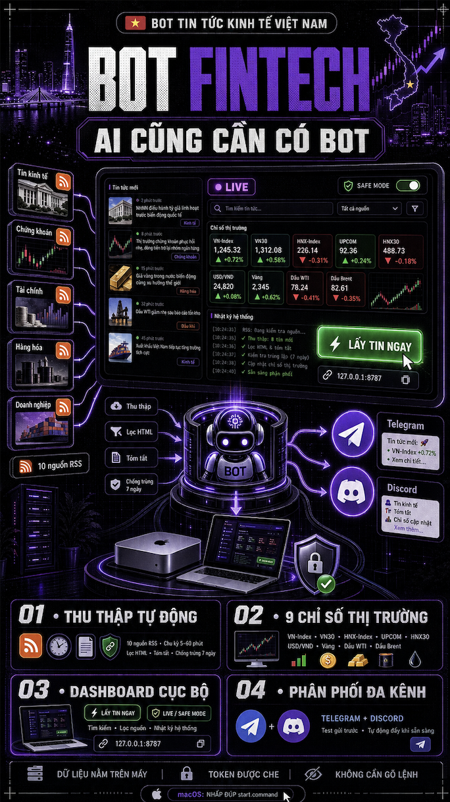

# BotFintech



**BotFintech** — nền tảng bot tin tức chạy cục bộ trên máy bạn: tự động thu thập tin từ các báo lớn, theo dõi số liệu thị trường, và đẩy tin mới lên Telegram/Discord. Đi kèm dashboard web phong cách trading để điều khiển bằng nút bấm, không cần gõ lệnh.

## Tầm nhìn BotFintech

BotFintech là nền tảng thu thập – làm sạch – phân phối này sẽ mở rộng sang nhiều lĩnh vực khác:

- **Giáo dục** — bot tin tức giáo dục: tuyển sinh, chính sách học đường, kỳ thi, học bổng; theo dõi lịch thi và điểm chuẩn
- **Chính trị** — bot tin tức chính trị – xã hội: nghị quyết, chính sách mới, hoạt động của Quốc hội và chính quyền địa phương
- Và các lĩnh vực khác khi nền tảng trưởng thành (y tế, thể thao, công nghệ…)

Mỗi lĩnh vực chỉ cần thay bộ nguồn RSS, bộ chỉ số theo dõi và kênh phân phối — kiến trúc lõi không đổi.

## Roadmap: từ bot tự động đến bot thông minh

Bot hiện tại đã đạt ~50% tiêu chuẩn một bot thông minh (tự động hóa, đa nguồn, chống trùng, đa kênh, dashboard, safe mode). Lộ trình bổ sung nửa còn lại:

- [x] **Phần 1 — Tương tác hai chiều**: ra lệnh cho bot ngay trong Telegram (`/latest`, `/search`, `/market`, `/status`, `/fetch`) thay vì chỉ nhận tin một chiều
- [x] **Phần 2 — AI làm giàu tin**: tóm tắt bài viết bằng LLM, tự phân loại chủ đề theo nội dung thay vì gắn cứng theo nguồn; tương thích mọi API chuẩn OpenAI (OpenAI, Ollama, LM Studio…)
- [x] **Phần 3 — Xếp hạng thông minh**: chấm điểm độ nóng 0–100 cho từng tin (từ khóa, cụm nhiều nguồn cùng đăng, số liệu, ưu tiên nguồn, chống clickbait), chỉ đẩy tin đạt ngưỡng lên kênh
- [ ] **Phần 4 — Cá nhân hóa**: học từ hành vi đọc của người dùng (mở/bỏ qua) để tinh chỉnh nội dung đẩy đi
- [ ] **Phần 5 — Phân tích & cảnh báo**: sentiment tin tức, phát hiện xu hướng, alert khi chỉ số thị trường vượt ngưỡng
- [ ] **Phần 6 — Kháng lỗi**: retry/backoff khi nguồn lỗi, health-check định kỳ, cảnh báo qua kênh khi nguồn chết

## Tính năng nổi bật

### Thu thập tin tự động

- **10 nguồn RSS** từ VnExpress, Tuổi Trẻ, Thanh Niên, VietnamNet, Tiền Phong và 4 chuyên mục CafeF (chứng khoán, tài chính quốc tế, tài chính ngân hàng, vĩ mô đầu tư) — thêm/xóa nguồn ngay trên giao diện
- **Chạy nền theo chu kỳ** 5–60 phút, không cần canh chừng
- **Chống trùng tin thông minh**: ghi nhớ link đã gửi trong `seen.json`, tự dọn link quá 7 ngày
- **Làm sạch nội dung**: tóm tắt bài viết được lọc HTML tự động

### Số liệu thị trường trực tiếp

Mỗi chu kỳ cập nhật bảng dữ liệu gồm 9 chỉ số:

| Nhóm | Chỉ số |
|---|---|
| Chứng khoán VN | VN-Index, VN30, HNX-Index, UPCOM, HNX30 |
| Tỷ giá | USD/VND |
| Hàng hóa | Vàng quốc tế (USD/oz), Dầu WTI, Dầu Brent |

Xanh lá = tăng, đỏ = giảm, hiển thị ngay trên thanh ticker đầu trang.

### Dashboard web (http://127.0.0.1:8787)

- **Nút LẤY TIN NGAY** — lấy tin tức thì bằng một cú bấm
- **Đèn trạng thái LIVE/SAFE MODE** nhấp nháy theo thời gian thực
- **Luồng tin tức** có lọc theo nguồn và tìm kiếm từ khóa
- **Nhật ký hệ thống** dạng terminal nền đen
- **Quản lý kênh gửi**: điền token, bấm Test gửi để kiểm tra ngay
- Chạy hoàn toàn cục bộ, dữ liệu nằm trong thư mục máy bạn

### Phân phối đa kênh

- **Telegram** và **Discord** — dùng một hoặc cả hai
- **Safe Mode mặc định**: bot chỉ thu thập và lưu tin; bật công tắc "Tự động đẩy tin" khi sẵn sàng
- Gửi tin kiểm tra trước khi bật thật để chắc chắn cấu hình đúng

### Lệnh Telegram hai chiều (Phần 1 của roadmap)

Nhắn trực tiếp cho bot trong Telegram:

| Lệnh | Chức năng |
|---|---|
| `/latest [số]` | tin mới nhất từ kho |
| `/top [số]` | tin nóng nhất theo điểm xếp hạng |
| `/search <từ khóa>` | tìm trong tiêu đề và tóm tắt |
| `/market` | bảng chỉ số thị trường kèm mũi tên tăng/giảm |
| `/status` | trạng thái hoạt động, chu kỳ, kênh gửi |
| `/sources` | danh sách nguồn RSS |
| `/fetch` | lấy tin mới ngay lập tức |

Chỉ chat ID đã cấu hình mới ra lệnh được bot; nếu `.env` chưa có `TELEGRAM_CHAT_ID`, người nhắn đầu tiên sẽ tự được ghi nhận.

### AI làm giàu tin (Phần 2 của roadmap)

Khi bật, mỗi tin mới trước khi gửi đi được LLM xử lý: **tóm tắt 1–2 câu tiếng Việt** và **tự gán nhãn chủ đề theo nội dung** (thay vì category cứng theo nguồn RSS). Tin chưa kịp xử lý hoặc khi AI lỗi vẫn được gửi bản gốc — bot không bao giờ dừng vì AI.

- Tương thích mọi API chuẩn OpenAI: OpenAI chính chủ, Ollama chạy máy local (`http://127.0.0.1:11434/v1/chat/completions`), LM Studio…
- Gom nhiều tin mỗi lần gọi để tiết kiệm chi phí; kết quả lưu cache trong `ai_cache.json` nên tin cũ không bị gọi lại
- Trần số tin gọi AI mỗi chu kỳ (`AI_MAX_PER_RUN`) — phần vượt trần gửi nguyên bản

Cấu hình trong `.env`:

```ini
AI_ENRICH=1                 # 0 = tắt hoàn toàn (mặc định)
LLM_API_URL=http://127.0.0.1:11434/v1/chat/completions
LLM_API_KEY=                # Ollama không cần key; OpenAI thì điền sk-...
LLM_MODEL=gpt-4o-mini       # ví dụ Ollama: llama3.1
AI_MAX_PER_RUN=20           # trần số tin gọi AI mỗi chu kỳ
```

### Xếp hạng thông minh (Phần 3 của roadmap)

Mỗi tin mới được chấm **điểm độ nóng 0–100** bằng tín hiệu thuần cục bộ (không cần LLM, không tốn phí):

| Tín hiệu | Ảnh hưởng |
|---|---|
| Từ khóa quan trọng (lãi suất, GDP, nghị quyết, Fed…) | + tối đa 30 — sửa từ trong `ranking_keywords.json` |
| Nhiều nguồn cùng đăng một chuyện (cụm tiêu đề tương tự) | +9 mỗi nguồn thêm, tối đa +27 |
| Tiêu đề/tóm tắt có số liệu cụ thể (%) | +6 |
| Nguồn ưu tiên (trường `"priority": 1–3` trong `sources.json`) | +4/bậc, tối đa +8 |
| Tiêu đề câu view ("sốc", "chấn động"…) | −9 |

Khi bật "Tự động đẩy tin", **chỉ tin đạt ngưỡng điểm mới được gửi** lên Telegram/Discord (`SCORE_SEND_MIN`, mặc định 38 — đã hiệu chỉnh trên ~500 tin thật: median toàn kho 22, tin đáng chú ý 40–50); nếu không tin nào đạt, gửi tối đa `SEND_TOP_FALLBACK` tin cao nhất để kênh không im lặng. Tin bị giữ lại vẫn nằm đầy đủ trên dashboard.

```ini
RANKING=1                   # 0 = tắt xếp hạng (gửi mọi tin)
SCORE_SEND_MIN=38           # ngưỡng điểm để đẩy tin lên kênh
SEND_TOP_FALLBACK=3         # nếu không tin nào đạt ngưỡng, gửi top N
```

Trên dashboard mỗi tin có huy hiệu điểm (đỏ ≥75, vàng ≥50); Telegram có lệnh `/top [số]` xem tin nóng nhất.

## Khởi động nhanh

macOS — nhấp đúp là chạy:

```
start.command
```

Hoặc bằng Terminal:

```bash
cd ~/bot/bot
.venv/bin/python app.py        # dashboard tại http://127.0.0.1:8787
```

Lần đầu tiên chạy `start.command`, bot tự tạo môi trường ảo và cài đặt mọi thứ.

### Cấu hình kênh gửi (`.env`)

```ini
TELEGRAM_BOT_TOKEN=...      # lấy từ @BotFather
TELEGRAM_CHAT_ID=...
DISCORD_BOT_TOKEN=...
DISCORD_CHANNEL_ID=...
FETCH_INTERVAL_MINUTES=30   # chu kỳ tự động lấy tin
AUTO_SEND=0                 # 1 = tự động đẩy tin khi có tin mới
```

Điền trực tiếp trong `.env` hoặc nhập qua dashboard (khuyên dùng — token bị che khi hiển thị).

### Chế độ dòng lệnh (không cần dashboard)

```bash
.venv/bin/python fetch_news.py --dry-run --limit 5   # xem thử, không gửi
.venv/bin/python fetch_news.py --limit 10            # lấy và gửi tin mới
```

## Cấu trúc thư mục

```
bot/
├── start.command        # nhấp đúp để khởi động (macOS)
├── app.py               # server dashboard + vòng lặp tự động
├── fetch_news.py        # lõi thu thập tin RSS + gửi kênh
├── telegram_bot.py      # lệnh hai chiều trên Telegram (roadmap phần 1)
├── ai_enrich.py         # tóm tắt + phân loại tin bằng LLM (roadmap phần 2)
├── ranking.py           # chấm điểm độ nóng 0-100, lọc tin đẩy kênh (roadmap phần 3)
├── market_data.py       # số liệu chứng khoán, tỷ giá, vàng, dầu
├── templates/index.html # giao diện dashboard
├── sources.json         # danh sách nguồn RSS (thêm "priority": 1–3 để tăng điểm nguồn)
├── ranking_keywords.json # nhóm từ khóa quan trọng + trọng số (tự tạo lần chạy đầu)
├── .env                 # token Telegram/Discord (không chia sẻ!)
├── news.txt             # bản tin lần chạy cuối
├── news.json            # kho tin cho dashboard
├── market.json          # snapshot chỉ số thị trường
├── seen.json            # chống trùng tin
├── ai_cache.json        # cache kết quả tóm tắt/phân loại của AI
└── bot.log              # nhật ký hệ thống
```

## Ghi chú kỹ thuật

- Bot chỉ lắng nghe trên `127.0.0.1` — không ai từ ngoài mạng truy cập được dashboard
- Nguồn dữ liệu: RSS chính thống của từng báo, bảng giá CafeF, Yahoo Finance
- Token chỉ lưu trong `.env` trên máy; dashboard luôn che token khi hiển thị
- Muốn bot chạy ngầm mãi dù tắt Terminal: dùng `start.command` trong cửa sổ riêng, hoặc cron `*/30 * * * * cd ~/bot/bot && .venv/bin/python fetch_news.py >> bot.log 2>&1`
